# 📸 Project Image Gallery

This gallery documents key steps and components in the eCommerce Microservices Platform setup.

---

## 🧱 Project Structure & Git

### Initial Commit to GitHub
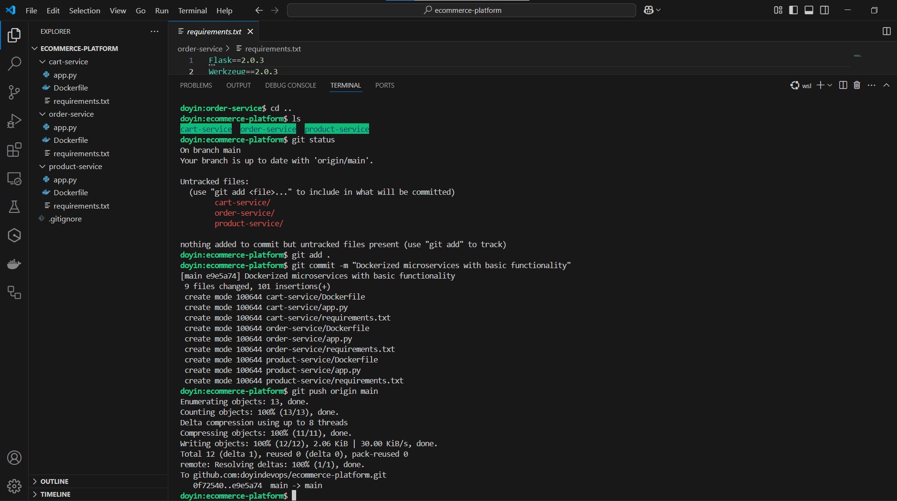

---

## 🧪 Microservices: Cart

### Code & Requirements

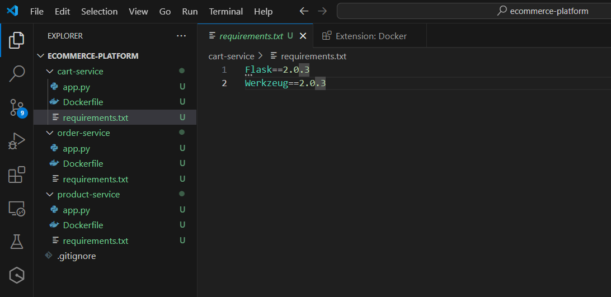

### Docker Build and Test
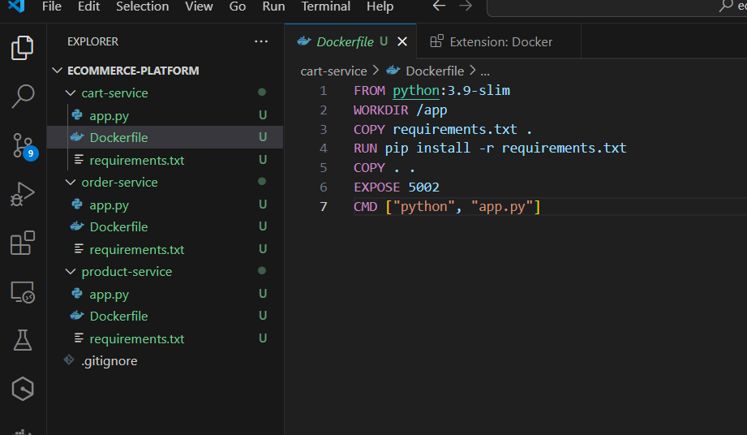
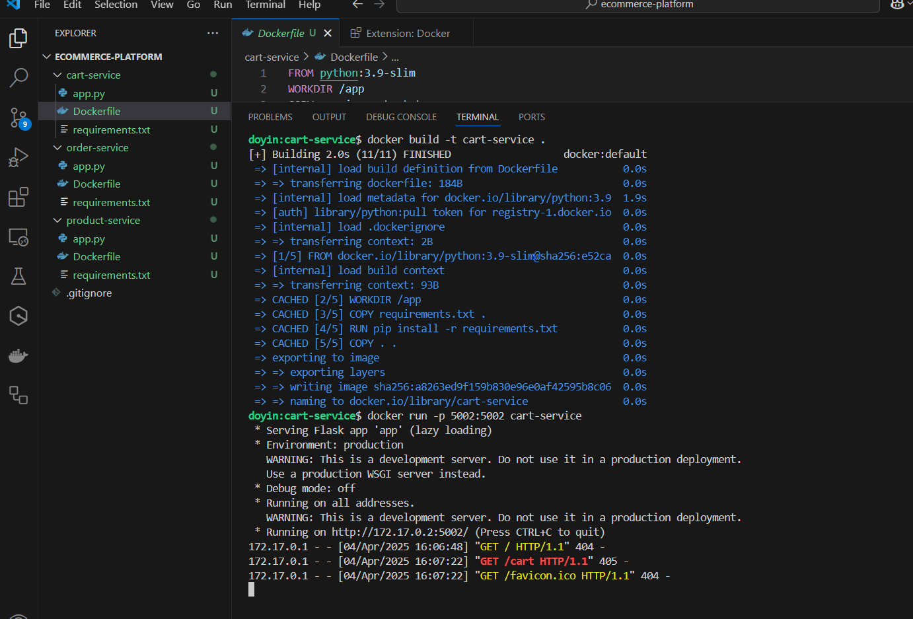
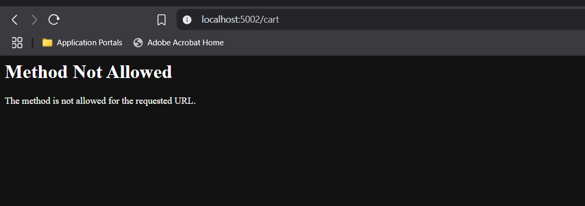

---

## 🧪 Microservices: Order

### Code & Requirements

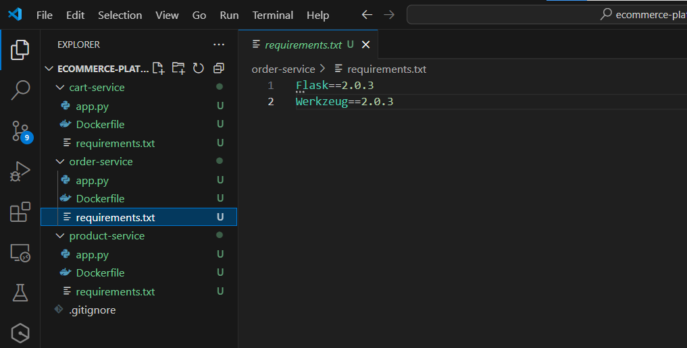

### Docker Build and Test
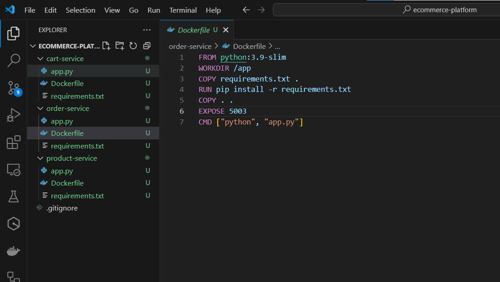
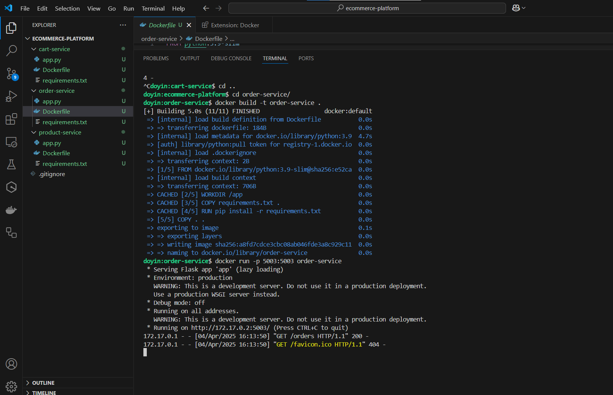
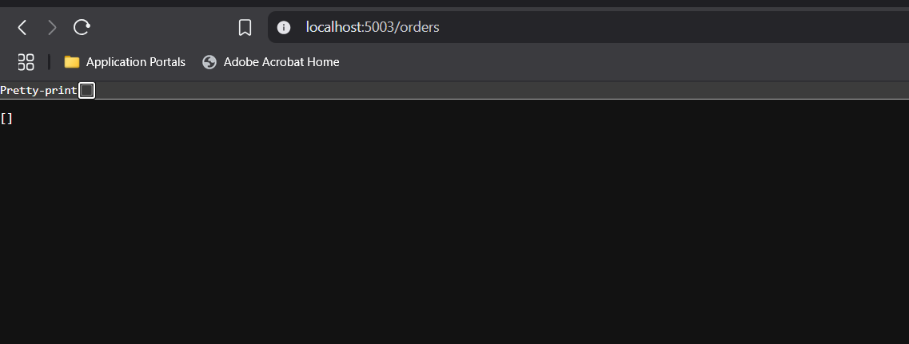

---

## 🧪 Microservices: Product

### Code & Requirements
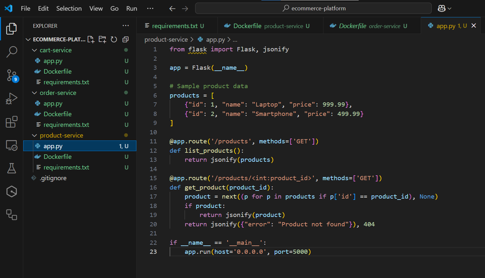
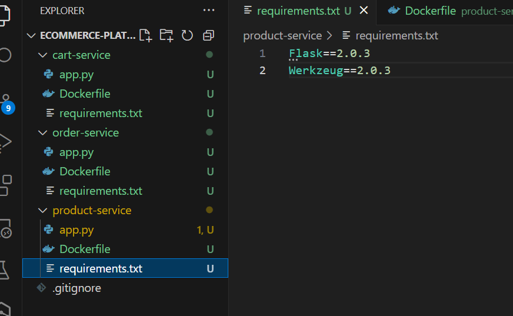

### Docker Build and Test
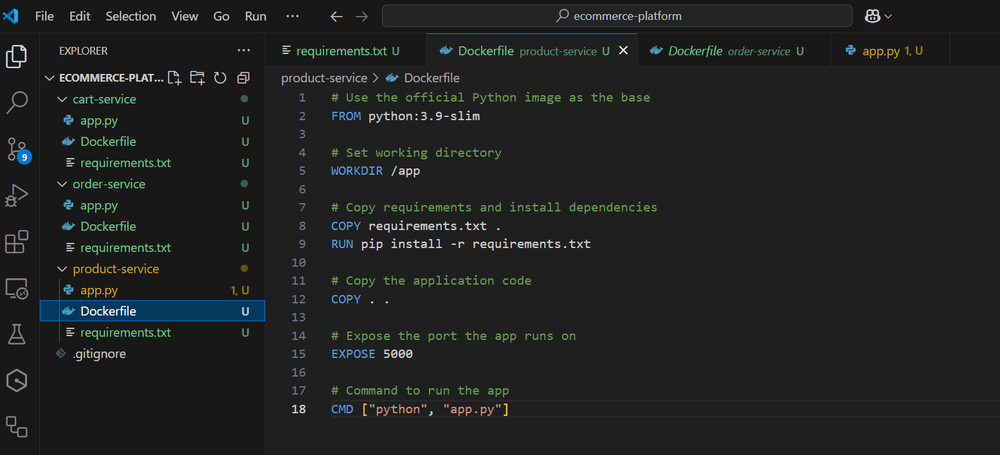
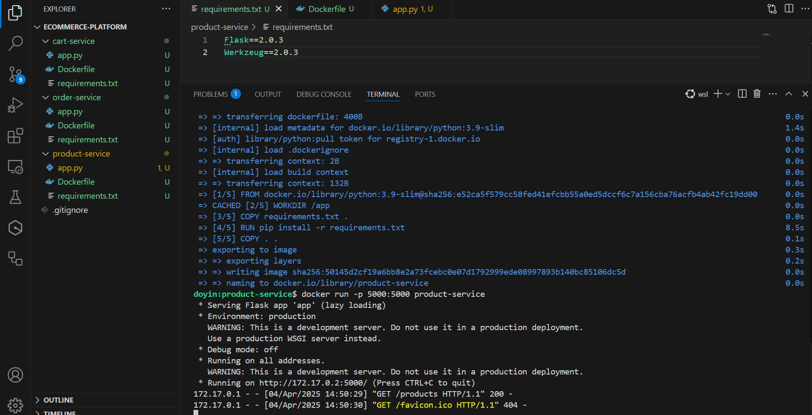
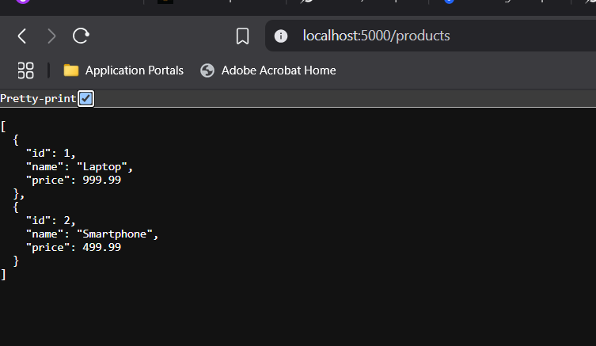

---

## ☁️ Amazon EKS – Kubernetes Cluster

### Cluster and Node Groups

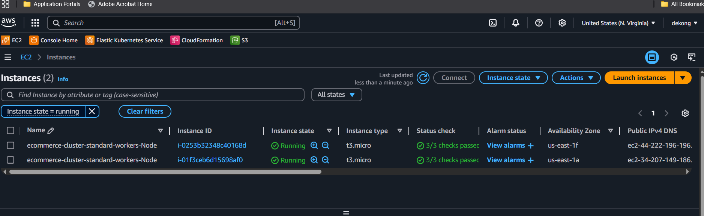

### EC2 Instances Backing the Cluster

---

## ☁️ DockerHub Summary (All Microservices)

- Cart: 
- Order: 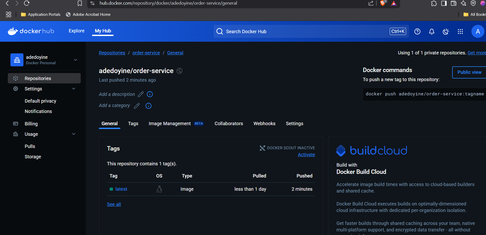
- Product: 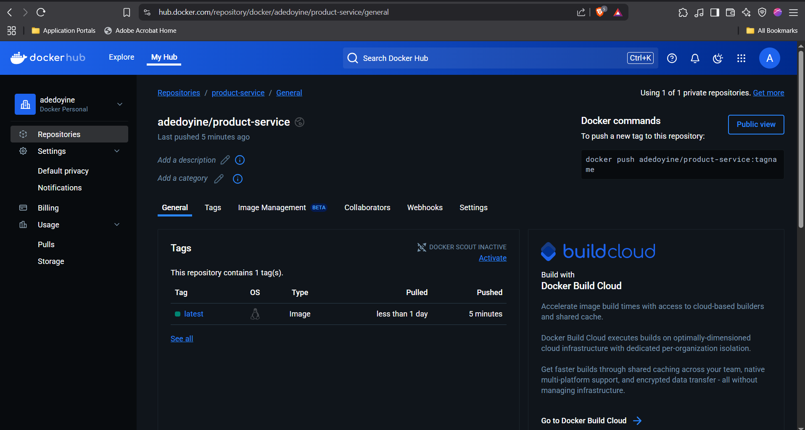

---

