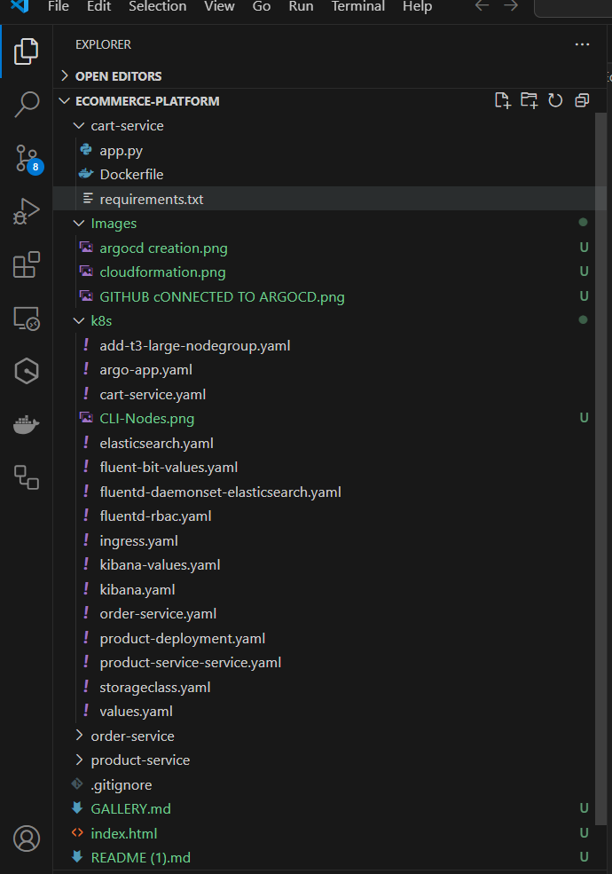
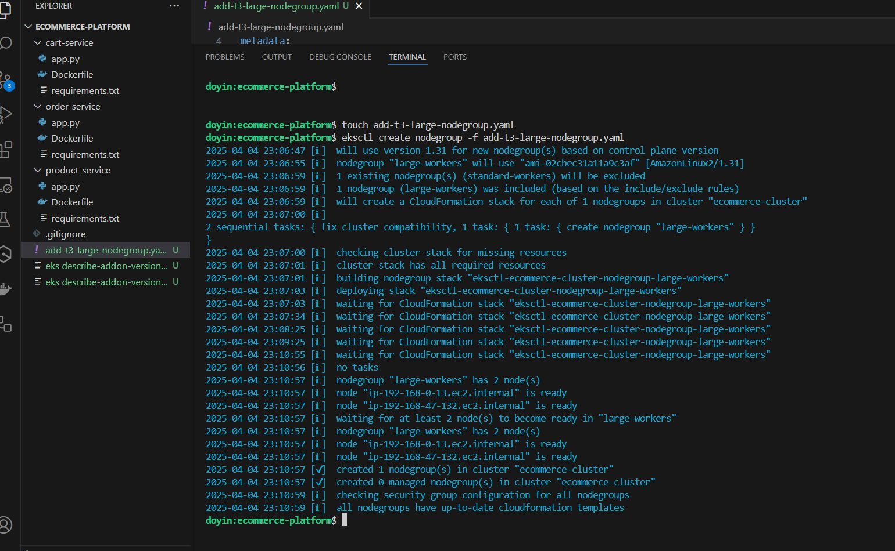
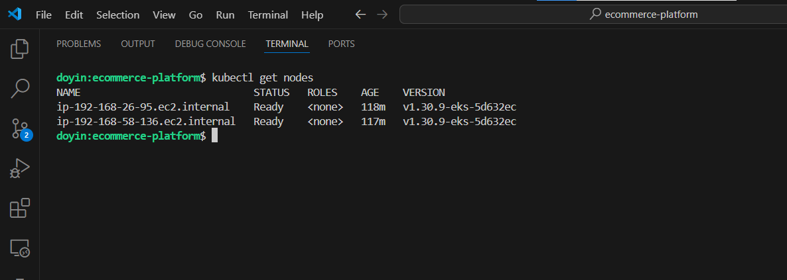

# 🛒 Ecommerce Microservices Platform on AWS EKS (GitOps with ArgoCD)

[](https://github.com/doyindevops)
[](https://www.youtube.com/@doyinekong/playlists)
[](LICENSE)

> **Created and maintained by [Adedoyin Ekong](https://github.com/doyindevops) – Cloud & DevOps Engineer**

---

**🚩 If you fork, please retain this attribution section to credit the original author.**

Welcome to a **production-grade microservices deployment** powered by Kubernetes on **AWS EKS**, GitOps with **ArgoCD**, CI/CD automation, and EFK logging/monitoring.

>  **Walkthrough Video**  
>  [Watch on YouTube](https://www.youtube.com/playlist?list=PL7KUROV69G9EhPTckM5g45ScJPhZioG4d) 

---

##  Project Highlights

-  Built with Flask-based microservices (`Product`, `Cart`, `Order`)
-  Deployed to **EKS Cluster** via ArgoCD and GitOps
-  Routed externally using **Kong Ingress**
-  Dockerized and pushed to **Docker Hub**
-  Logging and Monitoring via **Elasticsearch + Fluentd + Kibana (EFK)**
-  Autoscaling, custom Helm values, environment variables
-  Real-world troubleshooting & node upgrade case study

---

##  Tech Stack Overview

| Feature                 | Status        |
|-------------------------|---------------|
|  EKS Cluster           | ✅ Deployed    |
|  ArgoCD GitOps         | ✅ Synced      |
|  Ingress Routing       | ✅ Working     |
|  DockerHub Push        | ✅ Done        |
|  Elasticsearch + Kibana| ✅ Configured  |
|  Node Scaling          | ✅ Resolved    |
|  Monitoring & Logs     | ✅ Visualized  |

---

##  Architecture

> High-Level Overview



---

##  Repository Structure

```bash
ecommerce-platform/
├── cart-service/
├── order-service/
├── product-service/
├── k8s/
│   ├── argo-app.yaml
│   ├── ingress.yaml
│   ├── elasticsearch.yaml
│   ├── kibana.yaml
│   ├── fluentd-daemonset.yaml
│   ├── values.yaml
│   └── add-t3-large-nodegroup.yaml
├── Images/
│   ├── architecture.png
│   ├── argocd creation.png
│   ├── cloudformation.png
│   ├── GITHUB cONNECTED TO ARGOCD.png
│   ├── CLI-Nodes.png
│   └── Screenshot 2025-04-07 170136.png
└── .gitignore
```

---

##  DockerHub Repositories

Each service is containerized using **Docker**, and images are hosted publicly at:

| Service         | DockerHub Repository                             |
|-----------------|--------------------------------------------------|
| Cart Service    | `docker.io/adedoyine/cart-service`               |
| Order Service   | `docker.io/adedoyine/order-service`              |
| Product Service | `docker.io/adedoyine/product-service`            |

```bash
# Sample Docker build & push flow
docker build -t adedoyine/cart-service:latest .
docker push adedoyine/cart-service:latest
```

These are then pulled automatically in Kubernetes using ArgoCD & GitOps workflow.

---

##  GitOps with ArgoCD

ArgoCD automatically syncs from this GitHub repo to keep Kubernetes state declarative and up to date.

✅ GitHub repo connected successfully:


✅ ArgoCD UI initialized and apps deployed:



---

##  Microservices

Each service is:
- Dockerized (`Dockerfile`)
- Built locally and pushed to DockerHub
- Exposed via `Service + Deployment`
- Routed via `/products`, `/orders`, `/cart` paths using Kong Ingress

---

##  Ingress Routing (Kong Gateway)

```yaml
# k8s/ingress.yaml
- path: /products      -> product-service
- path: /orders        -> order-service
- path: /cart          -> cart-service
```

---

## ❗ Error Case Study: Pod Scheduling Issue & Resolution

### 🔍 Problem

ArgoCD pods stuck in `Pending` state:

```
0/2 nodes are available: 2 Too many pods.
```

###  Reason

- Using `t3.micro` EC2 instances
- Each node limited to ~4 pods due to ENI/IP limits

###  Fix: Upgrade to `t3.large` Nodes

```yaml
# add-t3-large-nodegroup.yaml
instanceType: t3.large
desiredCapacity: 2
```

 Created via:

```bash
eksctl create nodegroup -f add-t3-large-nodegroup.yaml
```

 CLI output:



---

## 📊 Observability: EFK Stack (Elasticsearch + Fluentd + Kibana)

- Real-time pod logs visualized via Kibana
- Fluentd collects logs from all namespaces
- Elasticsearch stores and indexes logs

 Setup Visual:


---

##  Future Enhancements

-  HTTPS with Cert-Manager + Route53
-  Add Redis/MongoDB for persistence
- ⚙ Helm templating + secrets
-  Add Prometheus + Grafana stack
-  Full CI pipeline with GitHub Actions

---

##  About Me

👋 Hi! I’m a DevOps enthusiast passionate about building scalable cloud-native platforms. This project reflects real-world scenarios such as GitOps, EKS scaling, microservice isolation, monitoring, and fault-tolerance.

📫 Let’s connect on [LinkedIn](https://www.linkedin.com/in/adedoyin-ekong/) 
